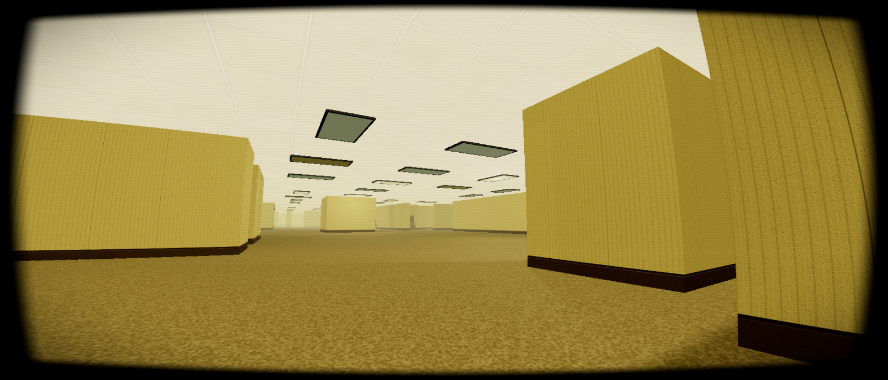

# Level 0 Engine: Procedural Liminal Space Simulator v0.9.8

A minimal-dependency, mathematically pure, procedural 3D environment generator running natively in a browser via ES6 modules.

There are no external image assets. There are no imported audio files. There are no build tools, package managers, or framework abstractions. Everything you see and hear is generated locally via raw physics, procedural mathematics, and the Web Audio API.

## Core Philosophy

This engine is built on absolute architectural minimalism and efficiency:
- **Procedural Geometry & The Sector Matrix:** The maze is generated via a Julia Set fractal algorithm. It is infinite, chaotic, and deterministic. The engine utilizes Geodesic Chunking to maintain a strict memory budget, routing the generation through a **Sector Matrix** to procedurally spawn distinct "Zones" — The Incinerator's combustion galleries, The Boardroom's glass fishbowl maze, The Archive stacks, The Server Farm, The Research Annex's corridors of locked steel doors, The Impound's chainlink pens under a rusted corrugated roof, The Checkpoint's decontamination gauntlet of hazmat gear and security gates, The Atrium's cavernous mall interior — a grocery-aisle shelving maze under fourteen cantilevered marble balcony tiers — The Clinic, The Maintenance Shafts, and The Chasm's suspended catwalks — each with unique geometry, floor and ceiling materials, tinted fog, reverb profile, footstep foley, and scheduled room tone. Every zone is sealed behind a single sliding blast door sitting flush on its true boundary — a hermetic threshold, not a corridor bored into the zone's own interior — and its atmosphere is governed by a ground-truth **Shell Volume Registry**: the world registers what it actually built, and the fog obeys.
- **Sector-Locked Hazards:** Five sectors carry their own dedicated hazard instead of the roaming Anomaly, each leashed to its own zone's geometry so it can never wander out into the connecting maze — and the Anomaly, in turn, is fully suppressed the instant you cross into any of them, so nothing can stalk you from the far side of a wall it has no line of sight through. The Archive's Archivist drifts and orbits at a curious distance, a fae-like presence that only scatters if you sprint too close. The Impound's Warden patrols on a sweeping searchlight, its sensor-eyes flaring solid red the instant it catches you in the beam. The Incinerator's Ember runs a "weeping angel" mechanic sharpened to a direct stare — hold it in your gaze dead-on and it freezes, banking heat instead of moving, then cashes that heat in as a fast, snake-like slither the moment you look away. The Server sector's Backup Daemon rides the ceiling's hanging cables ahead of your own heading, lighting the ones in your path; touch a live cable and it doesn't kill you outright, it zaps you to a random safe coordinate elsewhere in the sector. The Atrium's Claw stalks the ceiling above you and stays dormant as long as you keep moving; linger too long in an aisle with no shelf cover overhead and it telegraphs with a pulsing red floor light before dropping to snatch you up.
- **The Paper Trail (Seeded Narrative):** Every seed generates a complete cold case — a named research staff, a project, an incident, and one of three truths. All eleven sectors are sources, each with its own pool written in its own institutional voice and its own tape recorder: combustion logs and charge-door weights in the Incinerator, quarterly minutes and a seating chart one chair long in the Boardroom, thermal exceptions on a rack that was never powered in the Server Farm, decon gate counts that do not reconcile at the Checkpoint. Laptops are **Networked Terminals**: re-reading any of them browses the full recovered archive in discovery order.
- **Claims & Corroboration:** Documents do not deliver lore, they make *claims* — where the missing staffer went, that the floor plan will not hold still, that the hum carries information. A claim from one sector is rumour, and carrying rumour costs you: unverified reading accumulates as tension that pins your flashlight's charge ceiling and does not bleed off the way ordinary paranoia does. Six unverified reads and the light will not charge past 60%. To put that weight down you must find the same claim asserted by a **different sector**. Two impound tags naming the same person do not corroborate each other; neither does a tape and a memo pulled from the same room. Verification is priced in traversal, and settling a claim returns your ceiling, some clarity, and a little of the stamina the building has taken off you.
- **The Assembled Lock:** One keypad-locked records room per wing holds supplies and the elevator's release key. Nothing in the facility prints the code. The lock is the year the slab was poured followed by the impound pen that has never shut, two digits each, and those three facts — the rule, the year, the pen — are three separate claims sourced from three to five sectors apiece. A wrong entry names which leg you are still missing and never which digit was wrong. Across three random sectors you will hold all three legs roughly 44% of the time, so the door reliably costs a fourth or a fifth.
- **Physics & Lighting:** Collision detection relies on a highly optimized O(1) `SpatialHashGrid`, running on a homegrown `Vec3`/`AABB` math layer in `PlayerController.js`, `SomaticInput.js`, and the collision/pursuit paths of `Anomaly.js` and its five sector-locked counterparts (`ArchivistEntity.js`, `WardenEntity.js`, `IncineratorEntity.js`, `BackupDaemonEntity.js`, `ClawEntity.js`) — no `three` dependency required for physics math, though mesh and geometry construction still runs on `three` where that's genuinely its job. Dynamic lighting is managed by a 'Lumen Grid' that teleports a fixed set of hardware shadow-casters and continuous 'Fade Envelopes' to eliminate visual popping, with rank hysteresis keeping fixtures from flickering in and out near the edge of the active light pool.
- **Procedural Textures:** Every single texture is drawn pixel-by-pixel using the HTML5 Canvas API and injected directly into WebGL memory.
- **Procedural Audio & Acoustic Routing:** The ambient soundscape is powered by a live, made-from-scratch digital signal processor (DSP). The engine shifts the acoustics natively based on spatial logic — from the sterile hiss of corporate HVACs to the brown/pink/white fan-wash of the server halls to the recycled-air hush of the atrium's mall interior. The engine also casts volumetric audio raycasts to physically muffle sounds when occluded by walls. This is paired with **Surface-Aware Foley** (carpet thud, metal-grate clank, concrete scuff, linoleum click) and per-zone **Room Tones**: unseen patrons whisper, cough, and turn pages in the archive; chainlink shivers in the impound; a shopping cart's wheel ticks somewhere down an atrium aisle.
- **Adrenaline & Lethargy Curves:** Sprinting during casual exploration is efficient, but active pursuit by the Anomaly spikes adrenaline, burning oxygen twice as fast. Reaching terminal exhaustion physically crushes the audio filter, blurs the WebGL pipeline, and triggers a seamless decay of your velocity into a heavy, dragging stumble. This heavy breathing dynamically expands the Anomaly's auditory perception radius, and its pursuit speed is inversely coupled to your exhaustion: it literally feeds on panic. Furthermore, the body rejects preemptive healing; drinking Almond Water while above 70% capacity locks stamina recovery until the player reaches absolute exhaustion.
- **The Psychological Threshold:** The flashlight acts as a psychological shield, throttling the accumulation of paranoia but never reversing it. Hallucinations are strictly gated; visual FOV distortion, phantom auditory footsteps, and entity proximity hallucinations remain completely dormant until the player's psyche fractures past the 50% threshold.
- **The Quantum Observer Effect & Decoys:** The Anomaly actively hunts via line-of-sight and utilizes short-term spatial memory. It is also attracted to dropped UV tags, allowing for intentional misdirection. Catching the entity within a 30-degree cone of your flashlight mathematically freezes it in place. This angers it. And if it catches you, the engine executes a void blackout, mutates your seed string, and procedurally rebuilds a new reality.
- **Illumination & Systemic Cascades:** Traversal requires managing a heavy, incandescent flashlight that recharges from kinetic energy by sprinting in the dark or violently shaking your camera to crank out voltage. Players can find and interact with articulated **Surge Breakers** in the environment. Pulling a breaker triggers a catastrophic localized illumination cascade, shattering the bulbs and plunging the sector's atmospheric fog into a true, pitch-black void before executing a flickering reboot sequence.
- **Native Post-Processing:** The engine features a custom `WebGLRenderTarget` pipeline, applying dynamic Chromatic Aberration, crawling static, CRT scanlines, claustrophobic vignettes, and somatic retinal blurring. The optical feed is directly tethered to the Anomaly's proximity pressure, violently degrading into horizontal V-Hold tearing and desaturated static as the entity enters striking distance.

## Lore Editor

The engine ships with a built-in, zero-dependency Lore Editor to visually manage the procedural narrative payloads (`clues.json`, `finales.json`, `foreshadow.json`, etc.) without touching raw code. It fully supports authoring custom documents, configuring variable-driven logic, and customizing dynamic journal metadata (like `tell_title` and `tell_description` for custom Finales).
1. Double-click `start_editor.bat` (Windows) or run `./start_editor.sh` (Mac/Linux).
2. The editor will automatically open in your default browser at `http://localhost:3000`.
3. Use `stop_editor.bat` or `./stop_editor.sh` when you are done to shut down the backend.

## Usage

1. Clone the repository.
2. Double-click `start_engine.bat` (Windows) or run `./start_engine.sh` (Mac/Linux) to boot the local server. The game will automatically open in your default browser at `http://localhost:8080`. _Note: Opening `index.html` directly via the `file://` protocol will fail due to strict ES6 module CORS policies._
3. When you are finished, you can run `stop_engine.bat` or `./stop_engine.sh` to safely spin down the local server.
4. **Desktop Controls:**
- `Left-Click`: Engage a Pointer Lock (Look around)
- `Right-Click` (Hold): Kinematic Peek (Physically lean your camera 80cm around corners)
- `W, A, S, D`: Navigate spatial coordinates
- `Shift`: Sprint (Metabolically efficient until chased, then burns Adrenaline)
- `C`: Crouch (Lowers detection radius)
- `Q`: Squeeze (Compress collision radius to slide through narrow cracks)
- `F`: Toggle Flashlight (Consumes battery, expands detection radius)
- `E`: Somatic Interact (Doors, security keypads, documents, terminals, Surge Breakers, items)
- `Arrow Keys`: Browse the recovered archive while a terminal is open (`◄`/`▲` previous file, `►`/`▼` next file)
- `T`: Spray UV Decoy Breadcrumb (Mark your path and distract the Anomaly)
- `V` (Hold): Close Eyes (Blacks out the screen but rapidly bleeds off narrative tension and paranoia — you can't see anything while holding it, including whatever is hunting you)
- `X`: Capture Asset (Screenshot; same action as the settings panel's Capture Asset button)
- `J`: Open Personal Journal (Amber PDA)
- `P`: Raise/lower the Paintball Gun
- `M`: Raise/lower the Threshold Compass (Bearing to the nearest sector threshold)
- `Tab`: Toggle the settings menu (Drops pointer lock to allow OS mouse interaction)
- `Z`: Sector Warp (Debug: teleport to the first step inside the active macro-zone's northern blast door path)
- `G`: God Mode (Debug: invincible to the Anomaly and the void, noclip ghost flight — `Space` ascends, `C` held descends, sprint for speed)
- `` ` ``: Debug HUD (Seed, sector, chunk, FPS, draw calls, anomaly distance, POI and objective state)
- `1`: Use Battery
- `2`: Use Almond Water
- `ESC`: Release Pointer Lock/rest

_Level 0 is a desktop-only experience. Mobile/touch support was removed in v0.4.7 to focus the engine on a single input surface._

## The Environment

- **Sector Stabilization & Diegetic Radar:** Players must explore the labyrinth to locate and engage three Dimensional Switches to restore power and reveal the exit. The radar serves as a triangulation tool for these objectives, displaying distance to the nearest target, but scrambles (`ERR!_m`) under intense Anomaly electromagnetic pressure. The signal usually routes through anomalous points of interest first — a hole in the ceiling, a dinette bolted upside-down overhead, a working light panel sunk into the floor, a ring of chairs facing inward at nothing, a sealed door standing in the middle of a room attached to no wall with light bleeding out underneath — before resolving to a breaker.
- **The Exit Threshold & The Inquest:** A heavily fortified extraction bunker that only manifests in the generation matrix once all sector breakers are thrown *and* you are carrying the release key out of the records room. The elevator does not descend on touch: an Inquest terminal demands the Finding of Fact — three verdicts, keyed `1`/`2`/`3`. Nothing marks the correct one. The terminal reports how many claims you have settled and across how many sectors, and tells you plainly when filing would be a guess at one in three. The verdict has to come from a tell corroborated across the wing, seeded one apiece into five sectors. The ultimate objective is tracked dynamically in your PDA's journal (the "TELL" thread), which adapts its title and description to match the specific truth generated for that run. File the truth and the case closes for a clean descent with Coherence restored; file wrong and the seed mutates, rebuilding reality around a new cold case.
- **Ephemera:** The bunker's own paperwork, ringing the elevator car. A shift rota with one name on every weekday. A coffee fund nobody has touched since the disappearance. A debrief script with step four scratched through the lamination. A lost and found holding a cold wedding ring. These carry no claim, settle nothing, never enter the archive, and do not move your recovery count. They are the only paper in the facility that costs nothing to read and gives a little back, because by the time you are standing there you have earned something that is not more evidence.
- **The Threshold Compass:** A brass instrument you raise into view with `M`, held in a bare right hand with the sleeve of your jumpsuit running off the bottom of the frame, and the deliberate opposite of the radar. The radar knows precisely which breaker it wants and refuses to say which way it is, reports a bare distance, and scrambles under Anomaly pressure. The compass knows nothing about your objectives, cannot be scrambled, and answers exactly one question: which way is the nearest way *in*. It is magnetised to sector thresholds and remembers every one the seed has committed to, so it keeps pointing long after that zone has scrolled out of memory. A lost signal is no longer a random walk — you walk to a sector, re-establish where you are, and pick the hunt back up from a fixed landmark. Only the needle carries luminous paint; with the torch off, the dial is as dark as everything else. On a seed that has not yet produced a single macro zone the needle has nothing to hold and wanders.
- **The Paintball Gun:** A chunky, retro-FPS styled pistol raised into view with `P`. Stripped down to a minimalist, floating aesthetic where only the barrel, slide, and hammer are visible, keeping the central screen free of distracting hand or grip geometry.
- **Safe Rooms (The Outpost):** A rare chance for a fully enclosed, anomaly-shielded refuge featuring clean tile, a cot, guaranteed Almond Water, and an `isEntityBlocker` barrier that permits player entry while barring the entity.
- **The Surge Breakers:** Interactive, articulated breaker boxes. Press 'E' to crack the panel open and trigger a chunk-wide blackout cascade. Blackouts automatically resolve and restore lighting via an autonomic 25-35 second timer to preserve dynamic equilibrium.
- **Scavenged Resources:** Procedural battery cylinders restore 40% flashlight voltage (up to 3 held at once). Almond Water canisters grant 15 seconds of infinite stamina to aggressively outrun entities (up to 2 held at once). Both scatter through the maze via low-probability structural blueprints — wrecked furniture piles, safe rooms, set pieces — rather than a fixed count per chunk.
- **The Liminal Breach (Fast Travel):** Procedurally generated stairways have a 25% chance to spawn as open breaches. Walking up them uncaps the Y-axis constraints, allowing you to mathematically phase through the ceiling and warp thousands of units across the grid without mutating the quantum seed.
- **Ultraviolet Breadcrumbs:** Spray a glowing, high-visibility UV paint decal on walls (via surface-normal raycasting) to map the labyrinth and prevent circling.
- **Somatic Collisions:** High-speed kinematic impacts against structural geometry violently jolt the camera, bleed momentum, and trigger acoustic foley events. Kinematic vectors are decoupled, allowing you to seamlessly graze and slide along walls without losing perpendicular momentum.
- **Interactive Doors & Blast Thresholds:** Wood-grain doors swing open precisely 90 degrees away from your approach vector — except in the Research Annex, where every door is a heavy steel fire door with a wired-glass observation window, a scuffed kick plate, and a stenciled placard, framed in matching brushed steel instead of wood. Macro zones seal themselves behind a single proximity-triggered sliding blast door sitting flush on the zone's true boundary, with pneumatic grind, hazard-striped panels, a metal transition awning, and its own heavier mechanical voice — a hydraulic hiss grinding into a low metal thud — distinct from a hinged door's creak. In the Research Annex, most doors are permanently locked and visually identical to the ones that open — the only way to know is to try. One per wing carries a glowing keypad.
- **The Case File:** Notes, laptops, tape recorders, and property tags, all dealt from the seed's own story and stuck permanently to the object you found them on. Every document names the claim it makes and whether anything else in the wing backs it up, and a corroboration names both of its sources. Progress is tracked as a DATA RECOVERED readout, and any terminal can replay everything you've found in discovery order. You can also press `J` at any time to open your Personal Journal (Amber PDA) to review all collected lore without losing immersion, thanks to the in-engine Virtual Cursor system which keeps the OS pointer locked while you browse.
- **Claustrophobic Bottlenecks:** Corporate partitions have been excised in favor of absolute liminal emptiness and brutalist friction. The labyrinth dynamically generates blind L-shaped doglegs and tight 0.3-unit gaps. You must physically compress your body ('Q') to slide through them, restricting traversal speed.
- **Claustrophobic Particulates:** The volumetric dust cloud dynamically spikes in opacity and particle size when the player physically crawls through vents, simulating a choking atmosphere.

## The Generator

The settings panel (`Tab`) provides a full structural and performance control surface.
- **Level Seed:** Enter any string. The engine hashes the string into a 32-bit integer to seed the Julia Set. A "Find Sector..." dropdown and X/Z teleport fields sit next to it as debug utilities for jumping straight to a named sector or a raw coordinate pair.
- **Display Format:** Enforce strict cinematic aspect ratios (Dynamic, 4:3, 16:9, 21:9) via dynamic letterboxing.
- **Fog Density, Camera FOV, Player Speed:** Sliders governing the volumetric atmospheric drag (which dynamically "breathes" using an LFO), the field of view, and a global movement-speed multiplier.
- **Internal Resolution:** Downscale the internal WebGL rendering (100%, 50%, 25%) to boost GPU performance and heavily enhance the retro VHS pixelation.
- **Shadow Quality, Draw Distance, Anti-Aliasing:** Shadow map resolution (requires a refresh to apply), the chunk render radius, and MSAA sample count with an independent FXAA toggle.
- **Master Volume, Gamma:** Global mix level and post-tonemap exposure.
- **VHS/CRT Post-Processing, Head Bob:** Toggles for the native post-processing stack (chromatic aberration, scanlines, vignette) and the camera's walk-bob.
- **Rebuild Geometry:** Destroys the current manifold, resets the Spatial Hash Grid, and generates a new one.
- **Capture Asset:** Triggers a simulated camera flash and downloads a mathematically pure `.png` of your exact coordinates. Also bound to `X` in-game.
- **Save & Apply Settings / Purge Memory:** Persists the current panel state to `localStorage` for the next session, or wipes all saved settings and progress outright.

## Dependencies

- `Three.js (r128)` - Loaded via a `<script>` tag pointing at a hosted build, with no bundler or package manager involved, to preserve the zero-build-tool philosophy. Rendering, meshes, materials, and geometry still run on it; physics and collision math in `PlayerController.js`, `SomaticInput.js`, and the collision/pursuit paths of `Anomaly.js` and its five sector-locked counterparts (`ArchivistEntity.js`, `WardenEntity.js`, `IncineratorEntity.js`, `BackupDaemonEntity.js`, `ClawEntity.js`) do not — see `Vec3.js`/`AABB.js` below.

## Architecture

Zero-dependency ES6 modules, organized by concern:

- **Core:** `Environment.js` (chunk/zone lifecycle and the interaction hub tying every other system together), `TheArchitect.js` (the procedural blueprint factory facade), `RenderEngine.js` (the WebGL pipeline and post-processing shader).
- **Math:** `Vec3.js`/`AABB.js` (the homegrown vector and axis-aligned bounding box math replacing `THREE.Vector3`/`THREE.Box3` on the physics side, duck-typed so they interoperate with `three`'s own types without depending on them), `SpatialHashGrid.js` (O(1) collision/culling).
- **World:** `Sectors.js` (the sector registry: per-zone fog, tint, ambience, foley, and reverb in one table), `SectorBlueprints.js` (aggregates the twelve sector generators below), `StructuralBlueprints.js` (the base maze's own architectural variation — archways, half-walls, pillars, collapsed ceilings), `StructureKit.js` (the shared geometry-building toolkit every sector generates through), `SetPieces.js` (deterministic multi-mesh prefabs like airlocks and checkpoint rooms), `NarrativeProps.js` (shared document and recorder placement, called only from branches a sector has already cleared as walkable), and the twelve sector generators themselves in `src/world/sectors/`: Exit, Clinic, Annex, Archive, Chasm, Impound, Atrium, Maintenance, Boardroom, Checkpoint, Server, and Incinerator.
- **Aesthetics:** `ProceduralTextureFactory.js` (every texture, drawn pixel-by-pixel on an HTML5 Canvas), `MaterialLibrary.js` (the material/geometry cache built on top of it), `LumenGrid.js` (the fixed dynamic-light pool, with fade envelopes and shadow-slot prioritization to eliminate popping).
- **Entities:** `EntityManager.js` (orchestrates which single hazard is active per sector), `Anomaly.js` (the roaming default hazard active everywhere else), and its five sector-locked counterparts — `ArchivistEntity.js`, `WardenEntity.js`, `IncineratorEntity.js`, `BackupDaemonEntity.js`, and `ClawEntity.js` (see Sector-Locked Hazards, above).
- **Player:** `PlayerController.js` (metabolics and kinematics), `SomaticInput.js` (raw input translated into semantic intents), `InteractionController.js` (door/airlock/light state machines).
- **Narrative:** `StoryEngine.js` (the seeded cold-case machinery: dealing, sticky assignment, thread bookkeeping, corroboration), `CaseFiles.js` (what the documents actually say, kept apart from the machinery because prose and dealing logic change for different reasons and at different rates).
- **Audio:** `AcousticEngine.js` (the DSP core), `Synthesizer.js` (the persistent Web Audio graph), `Mixer.js` (real-time parameter modulation from telemetry/sector/somatic state), `Foley.js` (spatialized transient SFX).
- **UI:** `UIManager.js` (HUD), `DebugHUD.js`, `DocumentViewer.js`, `JournalViewer.js`, `InquestController.js`, `KeypadController.js`.
- **System:** `SaveManager.js` (persistence via `localStorage`), `SomaticController.js` (the environmental event bus routing physical/world events to audio and UI).