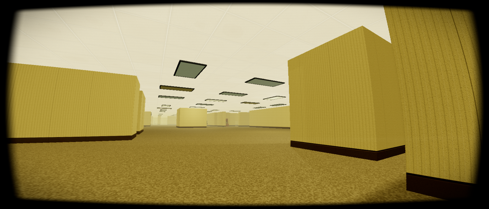

# Level 0 Engine: Procedural Liminal Space Simulator v1.5.8

> **Welcome to the endless backrooms.**
> The Level 0 Engine is a mathematically pure, zero-dependency procedural 3D horror simulator running natively in your browser. 
> You are trapped in an infinite, shifting corporate facility. Your only tools are a heavy kinetic flashlight and your own sanity.
> Can you find the truth and escape before the geometry mutates, or the Anomaly finds you?

---

## 📖 Primer Guide: How to Play

### The Objective
To escape, you must complete the **Finding of Fact** at the Exit Terminal.
Every seed generates a unique cold case about a missing staff member. You must explore the facility, find documents that make claims, and corroborate those claims to discover the truth.
But the elevator is locked. To use it, you must find the **Assembled Lock** code: a 4-digit PIN made of the "rule", "year", and "pen" found scattered across the facility.

### Survival & Sanity
- **The Flashlight:** Your primary psychological shield. It requires kinetic energy. Sprint or violently shake your camera to crank it and recharge it.
- **Paranoia:** Every unverified document you read increases your paranoia, capping your flashlight's max charge. To bleed it off, you must find a second document in a different sector that corroborates the same claim.
- **The Anomaly:** It actively hunts you via line-of-sight. If it catches you within the 30-degree cone of your flashlight, it freezes in place (but gets very angry). Sprinting burns oxygen twice as fast and terminal exhaustion expands its hearing radius. *It feeds on panic.*

### Controls
| Key | Action |
| --- | --- |
| `W, A, S, D` | Move |
| `Mouse` | Look around |
| `Left-Click` | Interact (Pick up documents, open doors, use terminals) |
| `Shift` | Sprint (Burns oxygen, recharges flashlight) |
| `Q` | Compress (Squeeze through tight bottlenecks and vents) |
| `F` | Toggle Flashlight |
| `E` | Pull Breakers |
| `M` | Raise Threshold Compass (Points to the nearest sector threshold) |
| `J` | Open PDA Journal (Review gathered lore via Virtual Cursor) |
| `P` | Equip Paintball Gun / UV Paint |
| `Tab` | Open Engine Settings Panel |
| `X` | Capture Asset (Downloads a clean PNG screenshot) |

---

## 🌌 Feature Tour

- **Procedural Audio & Acoustics:** A live, native digital signal processor (DSP) shifts room tones and physically muffles sounds when occluded by walls.
- **Physics & Lighting:** O(1) Spatial Hash Grid collisions and zero-allocation scratch vectors maintain silky 60fps. Dynamic lighting uses a fixed hardware shadow-caster pool with hysteresis to eliminate popping.
- **Somatic Collisions & Adrenaline:** Crashing into walls jolts the camera. Terminal exhaustion physically crushes your audio filter and triggers a heavy stumble.
- **Native Post-Processing:** Dynamic Chromatic Aberration, CRT scanlines, and claustrophobic vignettes tied directly to the Anomaly's proximity pressure.
- **The Case File:** Notes, laptops, and tape recorders stick to the objects you find them on.
- **Surge Breakers:** Pulling a breaker shatters local bulbs and initiates a terrifying blackout cascade before a flickering reboot sequence.

---

## 🪬 Anomalous Phenomena

- **The Threshold Compass:** A brass instrument (raised with `M`) that points to the nearest unvisited sector threshold. Once all breakers are pulled and the release key is found, the compass acts as your lifeline to the newly spawned Exit Bunker.
- **The Faraday Cage:** A rare entity-shielded refuge with solid copper walls and a glowing green terminal. 
- **The Liminal Breach:** Procedurally generated stairways have a 25% chance to spawn as open breaches, allowing you to warp thousands of units across the grid without mutating the seed.
- **Interactive Doors & Blast Thresholds:** Wood-grain doors swing open 90 degrees away from your approach vector. Macro zones seal themselves behind proximity-triggered sliding blast doors with their own heavy mechanical voice.
- **Ephemera:** Shift rotas, coffee funds, and lost-and-found wedding rings ring the Exit bunker. They carry no claim, settle nothing, and don't affect recovery counts—they are just echoes of a lost workforce.

---

## 🎛️ Settings & Tuning (The Generator)

Press `Tab` to open the settings panel for full structural and performance control:
- **Level Seed:** Enter any string. The engine hashes it into a 32-bit integer to seed the Julia Set.
- **Display Format:** Enforce strict cinematic aspect ratios (Dynamic, 4:3, 16:9, 21:9).
- **Internal Resolution:** Downscale internal WebGL rendering (100%, 50%, 25%) to boost GPU performance and heavily enhance retro VHS pixelation.
- **Fog Density, Camera FOV, Player Speed:** Sliders governing volumetric atmospheric drag, field of view, and a global movement-speed multiplier.
- **Shadow Quality & Anti-Aliasing:** Shadow map resolution and MSAA sample count with an independent FXAA toggle.
- **VHS/CRT Post-Processing:** Toggles for the native post-processing stack (chromatic aberration, scanlines, vignette).
- **Rebuild Geometry:** Destroys the current manifold, resets the Spatial Hash Grid, and generates a new one on the fly.

---

## 🛠️ Usage & Installation

1. Clone the repository.
2. Double-click `start_engine.bat` (Windows) or run `./start_engine.sh` (Mac/Linux) to boot the local server.
3. The game will automatically open in your browser at `http://localhost:8080`. *(Opening `index.html` directly via `file://` will fail due to strict ES6 CORS policies).*
4. You will be greeted by a terminal boot screen with a **Continue Session** or **Purge & Start New Game** prompt.

---

## 📝 Lore Editor

The engine ships with a built-in, zero-dependency Lore Editor to visually manage the procedural narrative payloads (`clues.json`, `finales.json`, `foreshadow.json`) without touching raw code.
1. Run `start_editor.bat` (Windows) or `./start_editor.sh` (Mac/Linux).
2. The editor opens at `http://localhost:3000`.

---

## ⚙️ Architecture & Dependencies

**Dependencies:**
- `Three.js (r160)` - Loaded locally with no bundlers. (Bare imports are strictly prohibited).
- `jsep` - Safely evaluates procedural logic.
- `marked` - Markdown renderer.
- `dompurify` - Sanitizes HTML strings.

**Architecture:**
Zero-dependency ES6 modules, organized by concern:
- **Core:** `Environment.js`, `TheArchitect.js`, `RenderEngine.js`.
- **Math & Physics:** Native `THREE.Vector3`/`Box3`. `SpatialHashGrid.js`.
- **World:** `ChunkManager.js` (the main-thread coordinator), `ChunkWorker.js` (Web Worker mesh generator), `ChunkStreamer.js`, `ChunkBuilder.js`, `ShaderWarmup.js`, `Sectors.js`, `SectorBlueprints.js`, `StructuralBlueprints.js`, `StructureKit.js`, `SetPieces.js`, `NarrativeProps.js`. The thirteen generators (Clinic, Annex, Archive, Chasm, Impound, Atrium, Maintenance, Boardroom, Checkpoint, Server, Incinerator, ACME, and Exit).
- **Aesthetics:** `ProceduralTextureFactory.js`, `MaterialLibrary.js`, `LumenGrid.js`.
- **Entities:** `EntityManager.js`, `HazardUtils.js`, `Anomaly.js`, and the six sector-locked entities (`ArchivistEntity.js`, `WardenEntity.js`, `IncineratorEntity.js`, `BackupDaemonEntity.js`, `ClawEntity.js`, `SentryConeEntity.js`), plus `PaintballSystem.js`.
- **Player:** `PlayerController.js`, `SomaticInput.js`, `InteractionController.js`.
- **Narrative:** `StoryEngine.js`, `CaseFiles.js`.
- **Audio:** `AcousticEngine.js`, `Synthesizer.js`, `Mixer.js`, `Foley.js`.
- **UI:** `UIManager.js`, `DebugHUD.js`, `DocumentViewer.js`, `JournalViewer.js`, `InquestController.js`, `KeypadController.js`, alongside dev-tuners (`SectorTunerFactory.js`, `AtmosphereTuner.js`, `LightTuner.js`).
- **System:** `SaveManager.js`, `SomaticController.js`.

**Browser Support:**
Chromium is recommended. Firefox is playable but relies on synchronous shader linking since it lacks `KHR_parallel_shader_compile` (bug 1736076), and rounds `performance.now()` to 1ms, resulting in a lower frame ceiling and potential hitching on new chunks.
